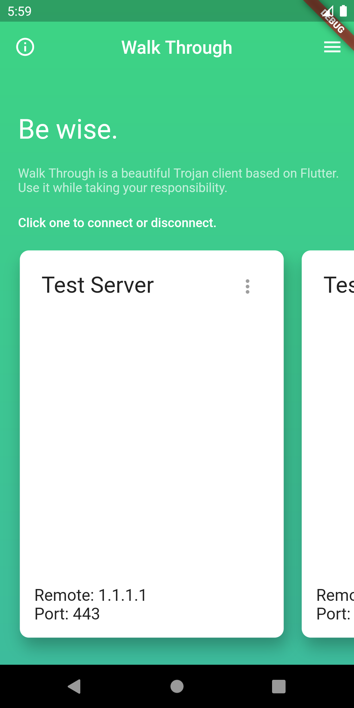

# Walk Through

A Trojan client for Android. This application is coded in Dart language and uses Flutter framework. 

Test passed on Android R.

## Features

- Multiple server management.
- Test connection.

## Screenshot

